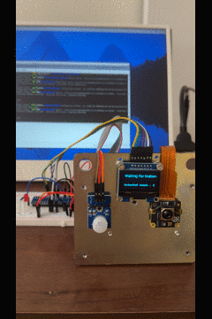
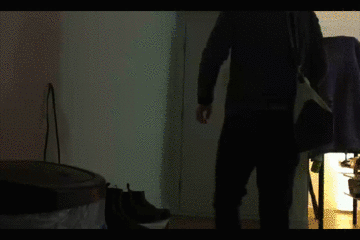
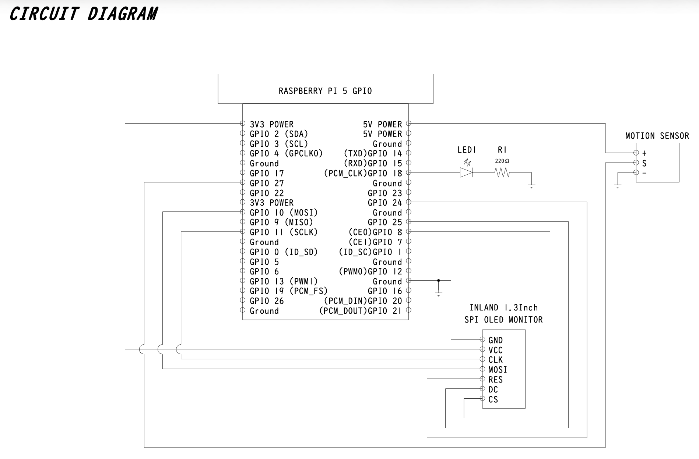

# House Camera Monitoring

## Overview
This project is a monitoring system built with a Raspberry Pi 5.
It detects motion, records video using a camera module, and logs detection timestamps.





## Why this project?
Maintenance services and room inspection in my apartment occur irregularly.
I wanted to monitor who enters the room.
While there are many commercial security camera products available, most of them requires a subscription to record video.
This project was created as a simple, subscription-free alternative.

## Technologies
- Raspberry Pi 5
- Raspberry Pi Camera Module 3
- GPIO Module
- Inland SPI 1.3" 128x64 OLED V2.0 Graphic Display Module
- Inland PIR Motion Sensor Module
- Python

## Circuit


## Features
- When motion is detected by the PIR sensor, the camera starts recording for 10 seconds.
- The LED turns on during recording.
- Each motion detection event is logged with a timestamp.
- When the program is terminated, the logged data (timestamps and video file names) are exported.
- The OLED display shows the current system status:
  - "Motion Detected"
  - "Waiting for Motion"


## Requirement

### OS packages
- libcamera-apps
- python3-picamera2
- python3-spidev

### Python packages
- openpyxl
- pillow
- gpiozero

Python packages are listed in 'requirements.txt' and can be installed using:
```bash
pip install -r requirements.txt
```

## Installation
1. Clone this repository.
2. Install required Python libraries.
3. Connect the hardware according to the circuit diagram.

## Usage
```bash
python main.py
```

## Notes
- This project is intended to run on Raspberry Pi OS.